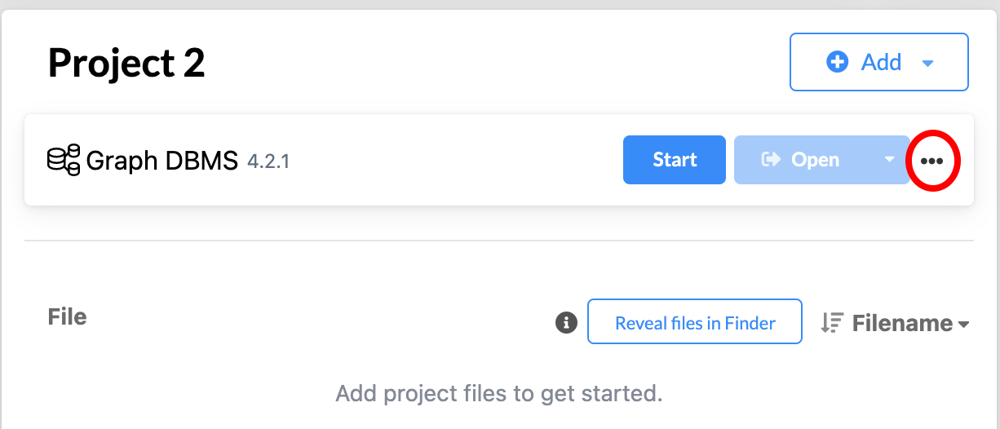
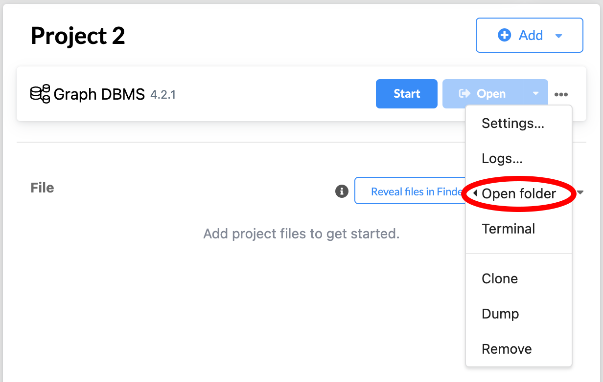
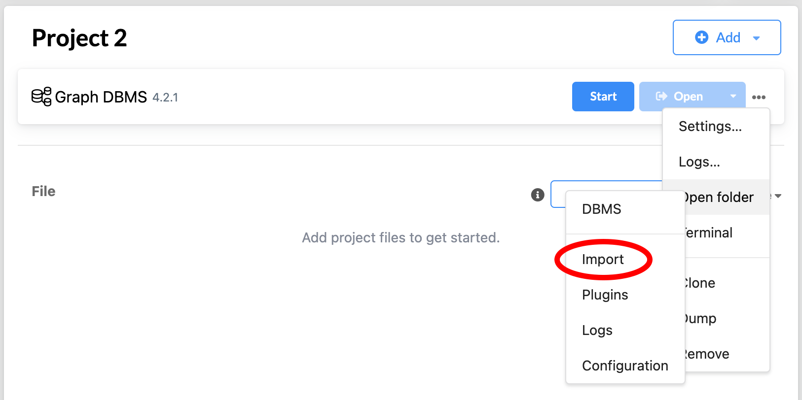

# Neo4J Example 1

This example illustrates the first stage of experimentation with workflow ontologies and knowledge representation. 

Attached is an PNG to give a visual of what the json file will appear as when entered into Neo4J. 

The following steps can be followed to load the json file into Neo4J and produce the corresponding nodes and relationships. 

## Step 1 - Enable Loading JSON Files

First, locate the settings for your Neo4J's DBMS.

Next, locate "Open Folder" in the DBMS settings drop down list. 

Then, select the "DBMS" option from the "Open Folder" drop down list. 

This should bring you to your filing system where you should locate the "conf" folder. There may be a file titled `apoc.conf`, but if the project is new there is a strong likelihood it does not exist yet. 

In either case, there must be a file named `apoc.conf` in the "conf" folder. This file must contain the line `apoc.import.file.enabled=true`.

After the `apoc.conf` has been created or updated, return back to the Neo4J interface and select "Graph DBMS".

Selecting "Graph DBMS" should bring up an additional pane with "Details", "Plugins", and "Upgrade" tabs. Under "Plugins" there is an option for "APOC" which you should install. 

From here, you the DBMS should be set up to load in a JSON file of nodes and relationships. 

## Step 2 - Add Example JSON File to Import Folder

Begin by again navigating to the "Open Folder" drop down list. 

In this folder that has been opened, you should upload this example's json file. 

## Step 3 - Adding the Nodes

Use the following Cypher code to add the nodes to your graph. This will give the nodes internal ids that match the example ids as there is no way to change the id given by Neo4J and the relationships in the json file are id dependent. 

    CALL apoc.load.json(
        "file:///Example_1_Full_Nodes_and_Relationships.json")  
    YIELD value  
    WITH value  
    UNWIND value as n  
    CALL apoc.do.when(  
        n.type = "node" and n.labels is NOT NULL,
        'CALL apoc.create.node(n.labels, apoc.map.setKey(
            n.properties, \'id\', n.id)) 
            YIELD node 
            RETURN node',
        '',
        {n:n}
    ) 
    YIELD value AS nodes
    RETURN nodes

## Step 4 - Adding the Relationships

Use the following Cypher code to add the relationships to your graph.

    CALL apoc.load.json(
        "file:///Example_1_Full_Nodes_and_Relationships.json") 
    YIELD value
    WITH value
    UNWIND value as n
    CALL apoc.do.when(
        n.type = "relationship",
        'MATCH (w {id: n.start.id}) 
            MATCH (y {id: n.end.id}) 
            CALL apoc.create.relationship(w, n.label, 
            n.properties, y) 
            YIELD rel 
            RETURN rel',
        '',
        {n:n}
    ) 
    YIELD value AS relationships
    RETURN relationships