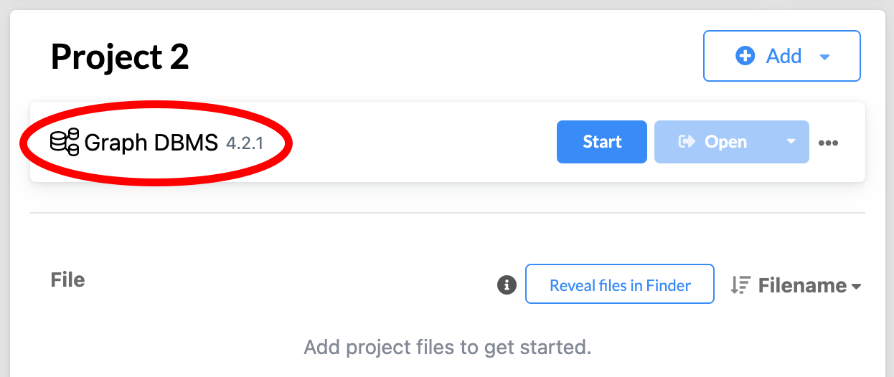

# sociotechnical-workflow-ontology
Public version of sociotechnical-workflow-ontology: an ontology and supporting tools for curation, query and search in graph databases

## Quickstart Guide
1. Download the Neo4J Desktop software here: [Neo4J Desktop Software](https://neo4j.com/download/).
2. Create a new project in Neo4J and add a Local DBMS to the project. 
3. Enable the ability to import JSON files into the project's DBMS. 
4. Choose which of the examples included within this repository that you would like to import and load the appropriate JSON file. 
5. Familiarize yourself with the [Cypher Query Language](https://neo4j.com/developer/cypher/) in order to run queries and create scripts for the graph.

## Table of Contents
1. [Download Neo4J Desktop Software](#download-neo4j-desktop-software)
2. [Creating a Project and Adding a DBMS](#creating-a-project-and-adding-a-dbms)
3. [Enable Import JSON](#enable-import-json)
4. [Import an Example JSON File](#import-an-example-json-file)

    1. [Load Graph Nodes](#load-graph-nodes)
    2. [Load Graph Relationships](#load-graph-relationships)
5. [Familiarize Self with Cypher Query Language](#familiarize-self-with-cypher-query-language)

## Download Neo4J Desktop Software
Downloading the Neo4J Desktop Software is easy and free. Simply follow along with the instructions included at the Neo4J website here: [Neo4J Desktop Software](https://neo4j.com/download/).

## Creating a Project and Adding a DBMS
To create a new project, select the `New` button next to the   `Projects` sidebar header. The new project will populate in the sidebar.  Select this project. This project will have an `Add` button next to its title. Upon selecting this button a dropdown bar will be revealed. Select `Local DBMS` from this dropdown. Name the DBMS to your preference and set your password. The examples were originally created using DBMS Version 4.2.1, but the examples have been tested with the latest DBMS Version 4.4.3 and will work with this as well. 

## Enable Import JSON
To aid in the process of enabling the ability to import JSON files, I have included visuals to match the instructions. 

First, locate the settings for your Neo4J's DBMS.

Next, locate "Open Folder" in the DBMS settings drop down list. 

Then, select the "DBMS" option from the "Open Folder" drop down list. 

This should bring you to your filing system where you should locate the "conf" folder. There may be a file titled `apoc.conf`, but if the project is new there is a strong likelihood it does not exist yet. 

In either case, there must be a file named `apoc.conf` in the "conf" folder. This file must contain the line `apoc.import.file.enabled=true`.

After the `apoc.conf` has been created or updated, return back to the Neo4J interface and select "Graph DBMS".

Selecting `Graph DBMS` should bring up an additional pane with `Details`, `Plugins`, and `Upgrade` tabs. Under `Plugins` there is an option for `APOC` which you should install. 

From here, you the DBMS should be set up to load in a JSON file of nodes and relationships. 

## Import an Example JSON File

Begin by again navigating to the "Open Folder" drop down list. 

In this folder that has been opened, you should upload this example's json file. 

### Load Graph Nodes

Use the following Cypher code to add the nodes to your graph. This will give the nodes internal id properties with specified values that match the example ids as there is no way to change the id given by Neo4J and the relationships in the json file are id dependent. Be sure to substitute the `File_Name` placeholder for the JSON file with the appropriate example file name. 

    CALL apoc.load.json(
        "file:///File_Name.json")  
    YIELD value  
    WITH value  
    UNWIND value as n  
    CALL apoc.do.when(  
        n.type = "node" and n.labels is NOT NULL,
        'CALL apoc.create.node(n.labels, apoc.map.setKey(
            n.properties, \'id\', n.id)) 
            YIELD node 
            RETURN node',
        '',
        {n:n}
    ) 
    YIELD value AS nodes
    RETURN nodes

### Load Graph Relationships

Use the following Cypher code to add the relationships to your graph. Be sure to substitute the `File_Name` placeholder for the JSON file with the appropriate example file name. 

    CALL apoc.load.json(
        "file:///File_Name.json") 
    YIELD value
    WITH value
    UNWIND value as n
    CALL apoc.do.when(
        n.type = "relationship",
        'MATCH (w {id: n.start.id}) 
            MATCH (y {id: n.end.id}) 
            CALL apoc.create.relationship(w, n.label, 
            n.properties, y) 
            YIELD rel 
            RETURN rel',
        '',
        {n:n}
    ) 
    YIELD value AS relationships
    RETURN relationships

## Familiarize Self with Cypher Query Language
In order to run queries on the graph you have now loaded into the Neo4J software, you must familiarize yourself with the [Cypher Query Language](https://neo4j.com/developer/cypher/). The link included provides a great starting point for understanding commands to use. The Neo4J community is large which should allow you to find easy answers if you were to use a search engine to locate answers about the language.

Example scripts and queries will be added soon. 
